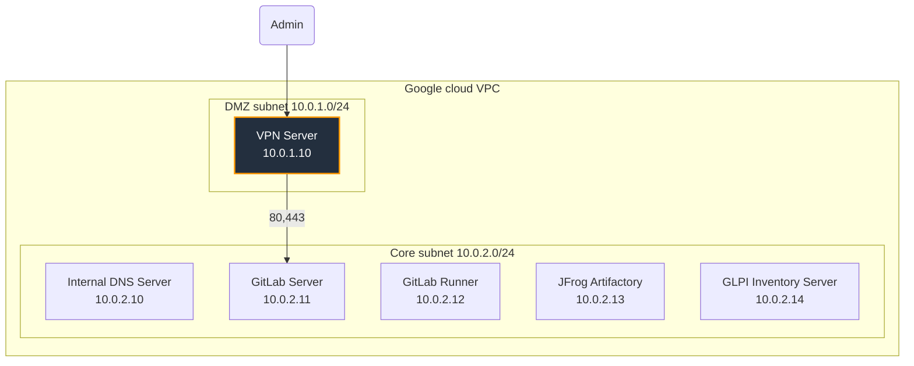

```mermaid
graph TD
    classDef SERVER fill:#232f3e,stroke:#ff9900,stroke-width:2px,color:#fff
    
    ADMIN(Admin) --> VPN

    subgraph VPC [Google cloud VPC]
        subgraph CORE [Core subnet 10.0.2.0/24]
            DNS[Internal DNS Server<br>10.0.2.10]
            GL[GitLab Server<br>10.0.2.11]
            GR[GitLab Runner<br>10.0.2.12]
            JF[JFrog Artifactory<br>10.0.2.13]
            GLPI[GLPI Inventory Server<br>10.0.2.14]
        end
        
        subgraph DMZ [DMZ subnet 10.0.1.0/24]
            VPN[VPN Server<br>10.0.1.10]:::SERVER
        end
    end

    VPN -->|80,443| GL
```
Servers sizing
VPN 1/2/10/Ubuntu 26.04
GL 2/8