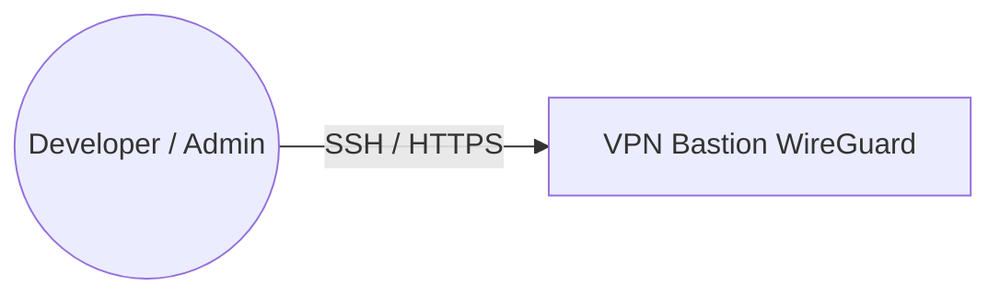

This is CI/CD hands on project.

Main goal - roll out CI/CD Pipeline in Google Cloud Platform (GCP) for Java development team

Above is scheme of CI/CD Pipeline

Next steps:
- use GCP IAM for auth
- use GCP managed router to isilate servers